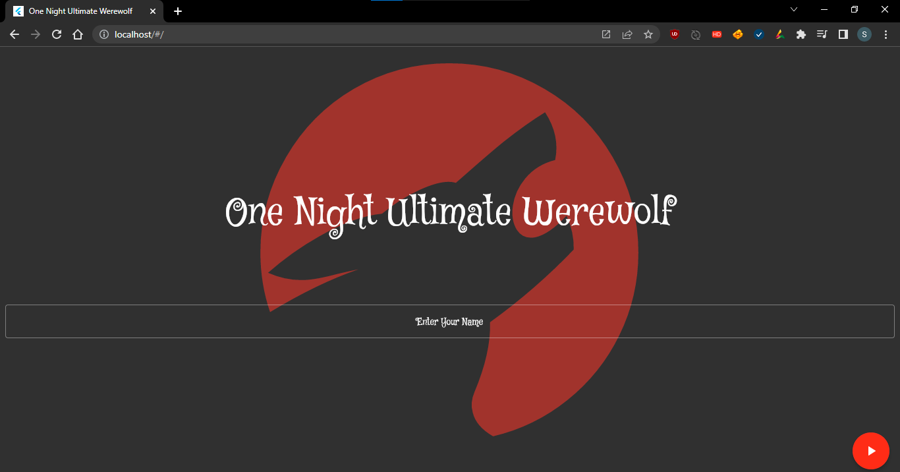
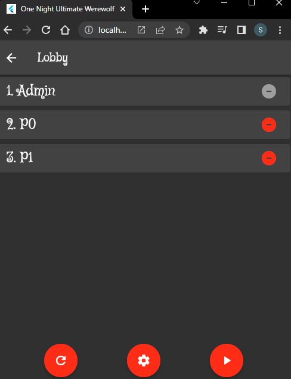
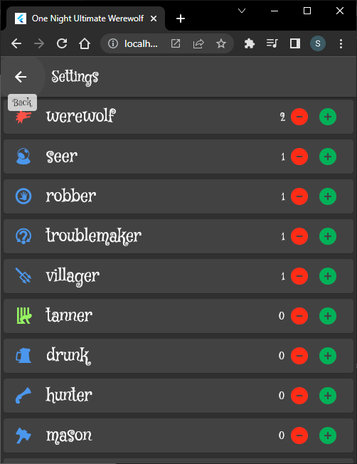
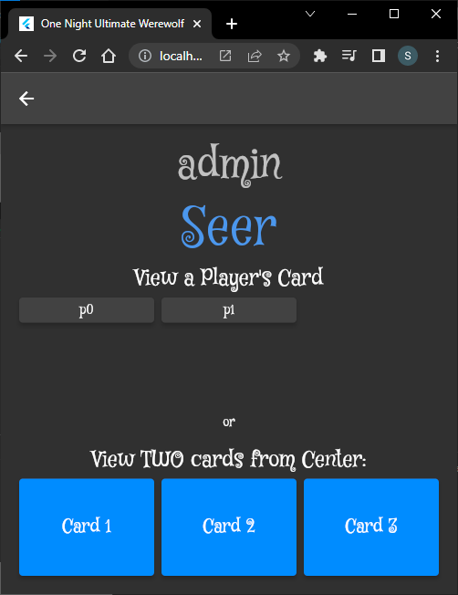
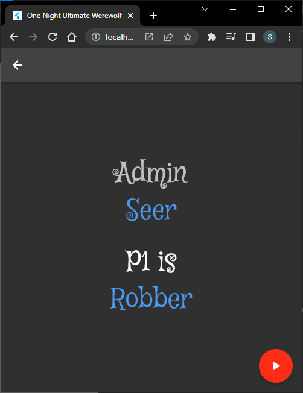
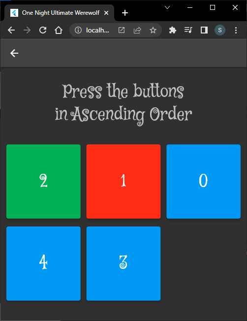
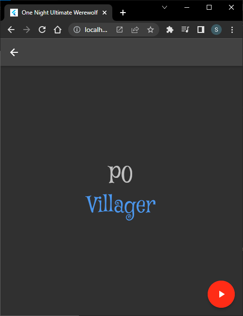
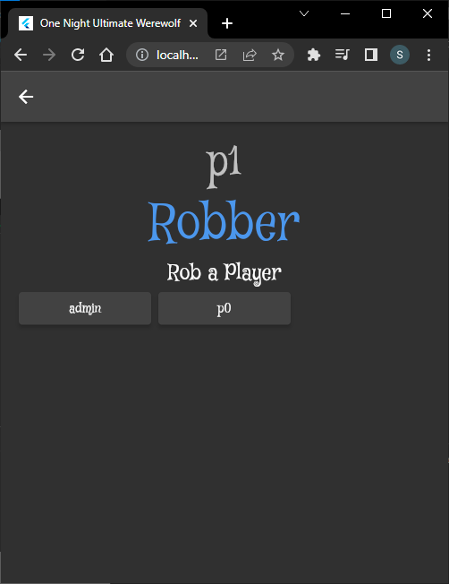
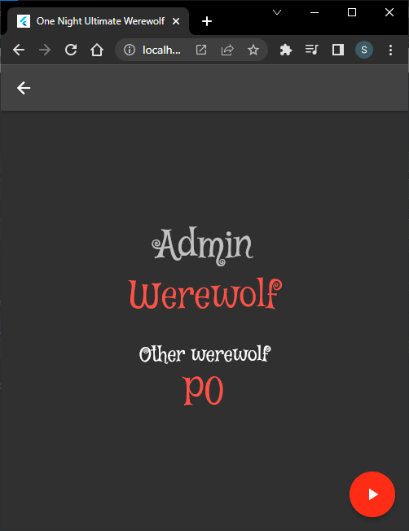

# One Night Ultimate Werewolf (front end)
The Flutter source code for the social deduction game "One Night Ultimate Werewolf".
  The built app must make API calls to the  [Spring Boot Server App](https://github.com/samliew94/onenightultimatewerewolf-server).

## Screenshots:

